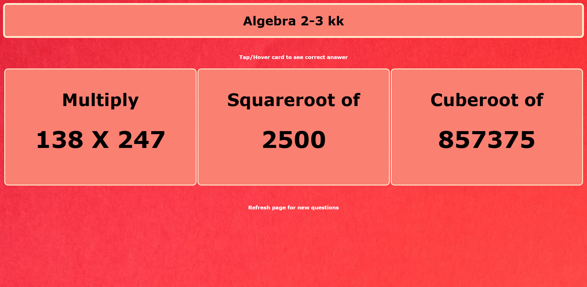

# Algebra-2-3-kk
This is a live website that will randomly generate mathematical questions, one from each category. Since this was developed for a client, there are three categories in this website.They are 'Multiply 2 3-digit numbers' , 'Find Squareroot of a number generated whose answer is from 1 to 100' and 'Find Cuberoot of a number generated whose answer is from 1 to 100'. CSS was used for the flip card feature,while javascript was used for randomly generating the questions. This website is hosted using Github Pages 

## Website
<a href="https://domingosjuliopinto.github.io/Algebra-2-3-kk/">https://domingosjuliopinto.github.io/Algebra-2-3-kk/</a>

## Images

## Notes
Background picture taken from a <a href="https://www.pexels.com/photo/red-background-with-123456789-text-overlay-1329296/">photo by Magda Ehlers from Pexels</a>

## Reference
<a href="https://www.w3schools.com/howto/howto_css_flip_card.asp">Flip Card</a>